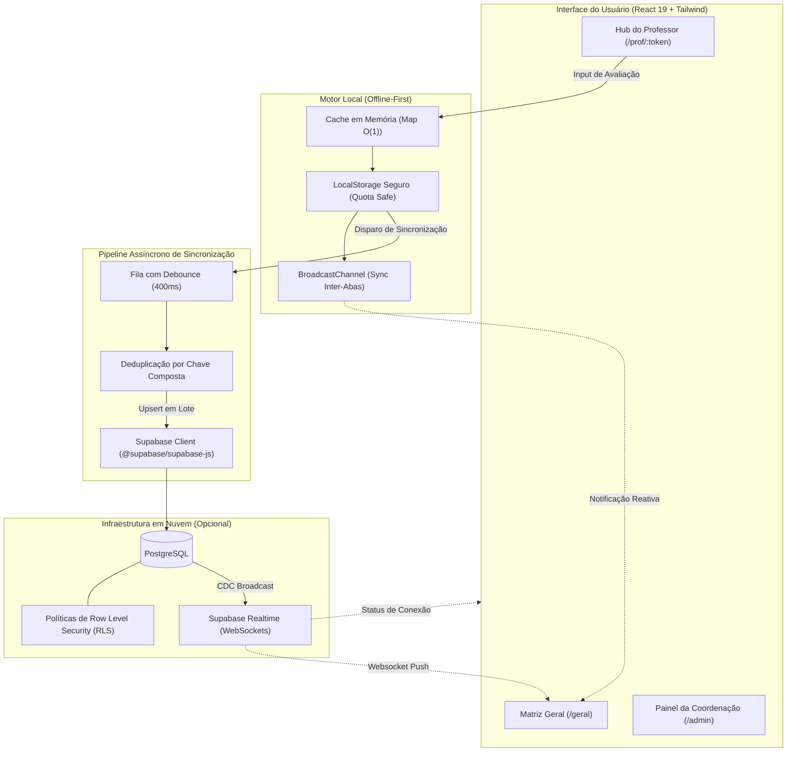

# Santa Marcelina — Pré-Conselho

<div align="center">


<p align="center">
  <strong>Plataforma moderna, resiliente e colaborativa para avaliação e consolidação pedagógica escolar.</strong>
</p>

<p align="center">
  Substitui planilhas descentralizadas e propensas a conflitos por uma Single Page Application (SPA) reativa, com arquitetura <em>offline-first</em>, persistência local protegida, sincronização em nuvem em tempo real e exportações sob demanda.
</p>

</div>

---

## 📋 Sumário

- [Visão Geral](#-visão-geral)
- [Diferenciais Técnicos & Engenharia](#-diferenciais-técnicos--engenharia)
- [Arquitetura e Fluxo de Dados](#-arquitetura-e-fluxo-de-dados)
- [Segurança, Privacidade & Conformidade (LGPD)](#-segurança-privacidade--conformidade-lgpd)
- [Funcionalidades Principais](#-funcionalidades-principais)
- [Stack Tecnológica](#-stack-tecnológica)
- [Estrutura de Rotas](#-estrutura-de-rotas)
- [Critérios Pedagógicos e Indicadores Visuais](#-critérios-pedagógicos-e-indicadores-visuais)
- [Como Executar Localmente](#-como-executar-localmente)
- [Configuração do Supabase](#-configuração-do-supabase-opcional)
- [Deploy na Vercel](#-deploy-na-vercel)
- [Estrutura do Repositório](#-estrutura-do-repositório)
- [Scripts Disponíveis](#-scripts-disponíveis)

---

## 🎯 Visão Geral

Nas rotinas escolares convencionais, as avaliações de pré-conselho ocorrem através de planilhas eletrônicas com dezenas de colunas preenchidas concorrentemente por dezenas de docentes. Esse modelo gera perda de dados, concorrência descontrolada, lentidão e esforço manual hercúleo por parte da coordenação para consolidar pareceres.

O **Santa Marcelina Pré-Conselho** foi concebido para resolver essa dor de ponta a ponta:
- **Para o Corpo Docente**: Acesso desimpedido via link direto tokenizado. As turmas de cada professor são dispostas em abas fluidas, com preenchimento ágil baseado em estados rápidos (`SIM`, `PARCIAL`, `NÃO`) e persistência imediata com debouncing.
- **Para a Equipe Pedagógica / Coordenação**: Painel executivo em tempo real com **Matriz Geral**, mapa de calor por estudante/matéria, alertas automatizados de intervenção pedagógica e geração instantânea de relatórios formatados em `.xlsx` e `.csv`.

---

## 🔬 Diferenciais Técnicos & Engenharia

### 1. Motor de Persistência Offline-First em Camadas
- **Cache Ativo em Memória (`Map`)**: Leituras e escritas instantâneas em $O(1)$, eliminando gargalos de I/O e *race conditions* em inputs de digitação acelerada.
- **Armazenamento Local com Barreira de Quota**: Escrita segura em `localStorage` encapsulada com tratamento específico de exceções para `QuotaExceededError` e disparo de eventos globais de notificação (`sm-storage-error`).
- **Sincronização Inter-Abas via `BroadcastChannel`**: Quando o mesmo usuário opera com múltiplas abas abertas no navegador, os eventos locais propagam instantaneamente sem necessidade de requisições ao servidor.
- **Tolerância a Perda de Estado via URL**: Parâmetros de contexto codificados (`&d=`) asseguram a integridade do link do docente mesmo em transições de dispositivos ou reinicializações de sessão.

### 2. Fila Assíncrona Inteligente (Debounce & Batch Dedup)
- **Agrupamento e Debounce de 400ms**: Alterações sucessivas feitas pelo professor são acumuladas em buffer volátil e despachadas em lotes compactos.
- **Deduplicação Pré-Envio por Chave Composta**: Os registros são deduplicados em memória usando a chave composta `turma | componente | trimestre | aluno_numero`, garantindo que apenas o estado final mais recente seja enviado ao banco. Isso previne erros do tipo `PostgreSQL 21000` (linhas duplicadas na mesma cláusula de upsert).
- **Mecanismo de Recuperação Linha-a-Linha**: Em caso improvável de rejeição em lote pelo PostgreSQL, o cliente chaveia automaticamente para um fallback de inserção unitária com isolamento de falhas.

### 3. Divisão Estratégica de Pacotes (Bundle Optimization)
- **Lazy Loading Dinâmico do SheetJS (`xlsx`)**: O motor de geração de planilhas binárias (`~424 kB`) é carregado sob demanda apenas quando o usuário aciona o botão de exportação Excel (`import('xlsx')`).
- **Núcleo Superleve**: O bundle JavaScript da aplicação principal permanece inferior a `56 kB` (gzipped), permitindo carregamento instantâneo mesmo em redes móveis 3G/4G instáveis.

---

## 🏗️ Arquitetura e Fluxo de Dados



---

## 🛡️ Segurança, Privacidade & Conformidade (LGPD)

> [!NOTE]
> Este projeto foi auditado para cumprir rigorosamente as diretrizes da **Lei Geral de Proteção de Dados (LGPD - Lei nº 13.709/2018)** no que tange ao repositório de código e apresentações públicas.

- **Zero Dados Pessoais em Código**: O repositório não contém nenhum dado pessoal real, planilha de alunos, registros de turmas reais ou anotações comportamentais confidenciais.
- **Geração de Mock 100% Sintética**: A funcionalidade de teste e demonstração utiliza um algoritmo procedural com nomes brasileiros sintéticos comuns, gerando turmas e notas puramente fictícias.
- **Proteção Ativa no `.gitignore`**: Todas as extensões de dados e exportações (`*.csv`, `*.tsv`, `*.xlsx`, `*.xls`) e arquivos de segredos locais (`.env*`) são bloqueados por padrão.
- **Controle de Acesso Modular**: Links com tokens determinísticos para docentes e senha administrativa para coordenação, isolando visões sem sobrecarga de cadastro prévio de contas.

---

## ✨ Funcionalidades Principais

- 🔗 **Link Exclusivo por Docente**: O professor acessa diretamente com seu token pessoal. As matérias e turmas atribuídas ficam organizadas em abas limpas.
- ⚡ **Auto-Save Instantâneo**: Salvamento transparente sem botão manual de "salvar"; feedback visual sutil com indicador de sincronização.
- 📊 **Matriz Geral & Heatmap**: Cruzamento multidimensional de estudantes e disciplinas, destacando visualmente casos de atenção pedagógica.
- 📥 **Exportações Prontas para Consumo**:
  - **CSV Universal**: Codificação UTF-8 com BOM e delimitador `;` para compatibilidade direta com o Excel brasileiro.
  - **XLSX Formatado**: Planilhas Excel com cabeçalhos estruturados geradas assincronamente no navegador.
- 🧪 **Gerador de Dados de Demonstração**: Área administrativa com gerador de dados mock para validar fluxos sem depender de planilhas externas.

---

## 🛠️ Stack Tecnológica

| Camada | Tecnologia | Detalhes & Finalidade |
| :--- | :--- | :--- |
| **Linguagem & Tipos** | JavaScript (ESNext) / Zod | Validação robusta de contratos de dados em runtime. |
| **Framework UI** | [React 19](https://react.dev/) | Renderização moderna e hooks funcionais para UI responsiva. |
| **Roteador** | [React Router 7](https://reactrouter.com/) | Rotas declarativas no cliente com layouts compartilhados. |
| **Build Tool** | [Vite 8](https://vitejs.dev/) | Compilação ultrarrápida, HMR instantâneo e split de chunks. |
| **Estilização** | [Tailwind CSS 3](https://tailwindcss.com/) | Glassmorphism, micro-interações e contraste visual WCAG 2.1. |
| **Banco & Realtime** | [Supabase](https://supabase.com/) | PostgreSQL gerenciado com sincronização via WebSockets. |
| **Processamento CSV** | [PapaParse](https://www.papaparse.com/) | Parsing rápido de planilhas com tratamento de aspas e delimitadores. |
| **Exportação XLSX** | [SheetJS](https://sheetjs.com/) | Geração binária de planilhas `.xlsx` sob demanda (lazy chunk). |
| **Qualidade de Código** | [Oxlint](https://oxc.rs/) | Linter em Rust de alta performance mantendo **0 erros e 0 warnings**. |

---

## 🧭 Estrutura de Rotas

| Rota | Descrição | Parâmetros Principais |
| :--- | :--- | :--- |
| `/` | **Página Inicial** | Apresentação institucional, atalhos rápidos e status geral do sistema. |
| `/prof/:token` | **Hub do Professor** | `?tri=2TRI` — Painel do docente com abas organizadas por turma e matéria. |
| `/hub` | **Hub por Disciplina** | `?comp=MAT&tri=2TRI&token=...` — Visão agregada de uma matéria específica. |
| `/p` | **Formulário Simples** | `?turma=1A&comp=MAT&tri=2TRI&token=...` — Modo direto por turma individual. |
| `/geral` | **Matriz da Coordenação**| `?turma=9A` — Painel consolidado com mapa de calor e exportações. |
| `/admin` | **Gestão Acadêmica** | Administração de turmas, alunos, docentes, tokens e parâmetros do ciclo. |

---

## 🎨 Critérios Pedagógicos e Indicadores Visuais

### Níveis de Avaliação do Estudante
- **SIM** (`Verde`): Atingimento pleno dos objetivos de aprendizagem, engajamento e convivência.
- **PARCIAL** (`Amarelo`): Desenvolvimento intermediário; requer acompanhamento regular ou pontual.
- **NÃO** (`Vermelho`): Dificuldade expressiva ou alerta comportamental; pauta para conselho de classe.

### Indicadores da Matriz Geral
- 🟢 **Ótimo**: Desempenho equilibrado e sem sinalizações desfavoráveis.
- 🟡 **Mediano**: Presença de avaliações parciais, sem medidas disciplinares graves.
- 🔴 **Alerta**: Presença de avaliações `NÃO` ou encaminhamentos ativos (apoio pedagógico, reforço ou contato familiar).

---

## 🚀 Como Executar Localmente

### Pré-requisitos
- [Node.js](https://nodejs.org/) versão 18 ou superior
- Gerenciador de pacotes `npm`, `pnpm` ou `yarn`

### 1. Clonar o repositório
```bash
git clone git@github.com:owmyr/SantaMarcelina.git
cd SantaMarcelina
```

### 2. Instalar dependências
```bash
npm install
```

### 3. Iniciar o servidor de desenvolvimento
```bash
npm run dev
```
Abra o navegador em `http://localhost:5173`.

> [!TIP]
> A aplicação funciona perfeitamente sem banco configurado: ela inicializa em modo local e permite gerar dados sintéticos de teste imediatamente através do botão "Gerar mock" em `/admin`.

---

## ⚙️ Configuração do Supabase (Opcional)

Para habilitar persistência remota centralizada e sincronização em tempo real entre múltiplos dispositivos:

1. Crie um projeto no [Supabase](https://supabase.com).
2. No **SQL Editor**, execute o script [`supabase/schema.sql`](file:///home/owmyr/Code/Projects/SantaMarcelina/supabase/schema.sql) para criar as tabelas, índices e publicação Realtime.
3. Crie um arquivo `.env` na raiz do projeto:
   ```env
   VITE_SUPABASE_URL=https://seu-projeto.supabase.co
   VITE_SUPABASE_ANON_KEY=sua-chave-anon-publica
   ```
4. Reinicie o servidor de desenvolvimento (`npm run dev`). O cabeçalho exibirá o status **Sincronizado**.

---

## 🚢 Deploy na Vercel

O projeto possui configuração pronta para deploy com um clique na **Vercel**:

1. Conecte o repositório `SantaMarcelina` na Vercel.
2. O preset **Vite** será reconhecido automaticamente.
3. Configure as variáveis de ambiente `VITE_SUPABASE_URL` e `VITE_SUPABASE_ANON_KEY` nas configurações do projeto na Vercel (se estiver utilizando Supabase).
4. Dispare o **Deploy**.

---

## 📂 Estrutura do Repositório

```
SantaMarcelina/
├── public/                  # Favicons e logotipo público da instituição
├── src/
│   ├── assets/              # Imagens e logotipos vetoriais do bundle
│   ├── components/
│   │   ├── FormFields.jsx   # Controles de avaliação (SIM/NÃO/PARCIAL) e observações
│   │   └── Layout.jsx       # Shell principal com indicador de conectividade
│   ├── lib/
│   │   ├── csv.js           # Utilitários de exportação/importação CSV e XLSX (lazy)
│   │   ├── fields.js        # Definição e metadados dos campos pedagógicos
│   │   ├── helpers.js       # Sanitização, normalização e parsing tolerante
│   │   ├── mockData.js      # Gerador procedural de dados sintéticos de teste
│   │   ├── storage.js       # Motor offline-first com cache em Map e barreira de quota
│   │   └── supabase.js      # Integração com Supabase, fila debounced e realtime
│   ├── pages/
│   │   ├── Admin.jsx        # Área administrativa e gerenciamento de acessos
│   │   ├── Geral.jsx        # Matriz geral, heatmap e central de relatórios
│   │   ├── Home.jsx         # Landing page e atalhos por componente curricular
│   │   ├── Professor.jsx    # Avaliação por turma única (modo direto)
│   │   └── ProfessorHub.jsx # Hub completo do docente com abas de turmas
│   ├── App.jsx              # Definição de rotas e providers
│   ├── index.css            # Estilização base com Tailwind CSS
│   └── main.jsx             # Ponto de entrada React 19
├── supabase/
│   └── schema.sql           # Esquema SQL relacional, índices e regras RLS
├── .env.example             # Modelo de variáveis de ambiente
├── .gitignore               # Regras de proteção para segredos e dados sensíveis
├── .oxlintrc.json           # Configuração de regras do linter Oxlint
├── package.json             # Metadados, dependências e scripts de execução
├── tailwind.config.js       # Configuração de temas e cores
├── vercel.json              # Configuração de reescritas de rota para SPA na Vercel
└── vite.config.js           # Configuração de compilação e code-splitting
```

---

## 📜 Scripts Disponíveis

| Comando | Descrição |
| :--- | :--- |
| `npm run dev` | Executa o servidor local de desenvolvimento com Hot Module Replacement (HMR). |
| `npm run build` | Compila o projeto otimizado para produção na pasta `dist/` com divisão de chunks. |
| `npm run preview` | Executa uma prévia local dos arquivos compilados em `dist/`. |
| `npm run lint` | Executa análise estática de código com **Oxlint** (0 warnings e 0 errors). |

