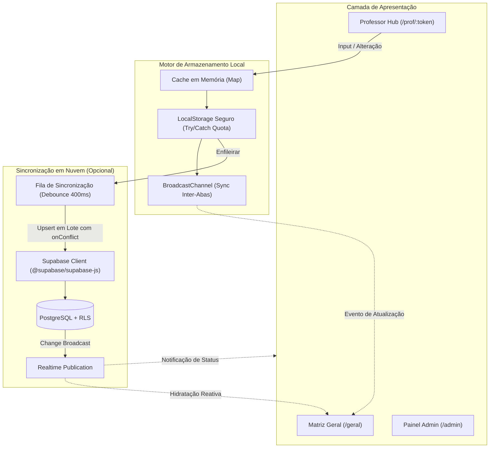

# Santa Marcelina — Pré-Conselho

> Sistema inteligente e moderno de avaliação e consolidação do pré-conselho pedagógico para o **Colégio Santa Marcelina**. Substitui planilhas extensas e descentralizadas por uma aplicação web rápida, colaborativa, responsiva e com sincronização em tempo real.

---

## 📋 Sumário

- [Visão Geral](#-visão-geral)
- [Principais Funcionalidades](#-principais-funcionalidades)
- [Stack Tecnológica](#-stack-tecnológica)
- [Arquitetura e Fluxo de Dados](#-arquitetura-e-fluxo-de-dados)
- [Estrutura de Rotas](#-estrutura-de-rotas)
- [Critérios Pedagógicos e Indicadores Visuais](#-critérios-pedagógicos-e-indicadores-visuais)
- [Como Executar Localmente](#-como-executar-localmente)
- [Configuração do Supabase (Opcional)](#-configuração-do-supabase-opcional)
- [Deploy na Vercel](#-deploy-na-vercel)
- [Estrutura do Projeto](#-estrutura-do-projeto)
- [Scripts Disponíveis](#-scripts-disponíveis)

---

## 🎯 Visão Geral

Historicamente, as avaliações de pré-conselho eram conduzidas através de planilhas complexas com dezenas de colunas, gerando conflitos de concorrência, lentidão e dificuldades na consolidação dos dados pela coordenação.

O **Santa Marcelina Pré-Conselho** foi desenvolvido para transformar esse processo em uma experiência fluida:
- **Para o Professor**: Um link exclusivo e direto dá acesso a todas as suas turmas em abas intuitivas, com formulários rápidos de três estados (`SIM`, `PARCIAL`, `NÃO`) e salvamento automático instantâneo.
- **Para a Coordenação**: Um painel administrativo centralizado permite gerenciar alunos, turmas, professores, gerar tokens de acesso e visualizar uma **Matriz Geral** consolidada em tempo real, com exportação para CSV e planilhas Excel formatadas.

---

## ✨ Principais Funcionalidades

- 🔗 **Link Único por Docente**: O professor recebe um único endereço contendo seu token de acesso. Todas as suas matérias e turmas atribuídas ficam organizadas em abas sem necessidade de login com senha.
- ⚡ **Salvamento Automático Debounced**: Alterações nos campos são gravadas localmente em memória e enfileiradas com debounce (400ms), garantindo que nenhuma digitação seja perdida mesmo durante oscilações de rede.
- 🌐 **Arquitetura Offline-First Resiliente**:
  - Opera **100% offline** com armazenamento em `localStorage` protegido contra cotas excedidas (`QuotaExceededError`) e cache acelerador em memória (`Map`).
  - Sincronização inter-abas automática via **BroadcastChannel**.
  - Suporte a recuperação de dados via parâmetros codificados na URL (`&d=`).
- ☁️ **Sincronização em Tempo Real (Supabase)**: Integração nativa com PostgreSQL e Supabase Realtime para sincronizar preenchimentos entre docentes e a coordenação instantaneamente.
- 📊 **Matriz Consolidada Geral (`/geral`)**: Tabela de calor (heatmap) cruzando alunos e componentes curriculares, com filtros rápidos por turma, status de preenchimento (`todos`, `pendentes`, `concluídos`) e alertas pedagógicos.
- 📥 **Exportação Sob Demanda**:
  - Exportação para **CSV** compatível com Excel brasileiro (separador `;` e codificação UTF-8 com BOM).
  - Exportação para **XLSX (Excel)** com carregamento dinâmico assíncrono (lazy loading), poupando mais de 50% do bundle inicial.
- 🧪 **Ambiente com Mock Data Inteligente**: Ferramenta integrada na área administrativa para popular o sistema com dados de teste realistas sem expor informações sensíveis.

---

## 🛠️ Stack Tecnológica

| Camada | Tecnologia | Descrição |
| :--- | :--- | :--- |
| **Framework** | [React 19](https://react.dev/) | Biblioteca UI reativa de última geração com renderização otimizada. |
| **Roteamento** | [React Router 7](https://reactrouter.com/) | Roteamento declarativo no lado do cliente com suporte a layouts aninhados. |
| **Build & Bundler** | [Vite 8](https://vitejs.dev/) | Ferramenta de build ultrarrápida com divisão estratégica de chunks (`manualChunks`). |
| **Estilização** | [Tailwind CSS 3](https://tailwindcss.com/) | Design utility-first com estética moderna, translucidez (glassmorphism) e contraste validado (WCAG). |
| **Backend & Realtime** | [Supabase](https://supabase.com/) | PostgreSQL em nuvem com Row Level Security (RLS) e Realtime WebSockets. |
| **Manipulação CSV** | [PapaParse](https://www.papaparse.com/) | Parser e gerador rápido de CSV com sanitização e suporte a delimitadores flexíveis. |
| **Exportação Excel** | [SheetJS (xlsx)](https://sheetjs.com/) | Geração de planilhas `.xlsx`, carregado via dynamic import (`import('xlsx')`). |
| **Validação** | [Zod](https://zod.dev/) | Tipagem e validação rigorosa de esquemas de dados. |
| **Qualidade de Código** | [Oxlint](https://oxc.rs/) | Linter estático em Rust, de altíssima velocidade, mantendo 0 warnings e 0 errors. |

---

## 🏗️ Arquitetura e Fluxo de Dados

O sistema prioriza a responsividade e a tolerância a falhas através de uma estratégia de múltiplas camadas de armazenamento:



### Resolução de Conflitos e Integridade
1. **Chaves Compostas**: Respostas são indexadas por `(turma, componente, trimestre, aluno_numero)`.
2. **Deduplicação Pré-Sync**: Mutações rápidas do mesmo registro (<400ms) são consolidadas em memória antes do envio.
3. **Restrições no Banco**: Políticas de `upsert` com cláusula `onConflict` explícita evitam duplicidades (HTTP 409).
4. **Isolamento de Erros**: Falhas de rede transitórias acionam retentativas com backoff; erros permanentes não travam a fila da interface.

---

## 🧭 Estrutura de Rotas

| Rota | Descrição | Parâmetros Principais |
| :--- | :--- | :--- |
| `/` | **Página Inicial** | Apresentação institucional, atalhos para turmas e acesso administrativo. |
| `/prof/:token` | **Hub do Professor** | `?tri=2TRI` — Formulário do docente com abas para cada turma associada. |
| `/hub` | **Hub por Componente** | `?comp=MAT&tri=2TRI&token=...` — Visualização agregada de uma matéria específica. |
| `/p` | **Formulário Legado** | `?turma=1A&comp=MAT&tri=2TRI&token=...` — Avaliação pontual de 1 turma. |
| `/geral` | **Visão Geral** | `?turma=9A` — Matriz consolidada da coordenação com mapa de calor e exportações. |
| `/admin` | **Coordenação** | Gestão de turmas, docentes, alunos, geração de links e configuração acadêmica. |

---

## 🎨 Critérios Pedagógicos e Indicadores Visuais

### Classificação de Desempenho
As respostas avaliam dimensões fundamentais do desenvolvimento do estudante:
- **SIM** (`Verde`): Atinge plenamente os objetivos de aprendizagem, engajamento e convivência.
- **PARCIAL** (`Amarelo`): Em desenvolvimento; requer atenção regular ou intervenções pontuais.
- **NÃO** (`Vermelho`): Dificuldade acentuada; aciona sinalizador para discussão em conselho.

### Matriz de Cores no Dashboard Geral
- 🟢 **Ótimo**: Registro sem apontamentos desfavoráveis ou alertas.
- 🟡 **Mediano**: Presença de avaliações parciais, sem alertas graves.
- 🔴 **Atenção / Alerta**: Presença de avaliações `NÃO` ou sinalizações ativas de intervenção (necessidade de apoio pedagógico, medidas disciplinares ou encaminhamentos).

---

## 🚀 Como Executar Localmente

### Pré-requisitos
- [Node.js](https://nodejs.org/) versão 18 ou superior
- Gerenciador de pacotes `npm` (ou `pnpm`/`yarn`)

### 1. Clonar o repositório
```bash
git clone git@github.com:owmyr/SantaMarcelina.git
cd SantaMarcelina
```

### 2. Instalar dependências
```bash
npm install
```

### 3. Executar o ambiente de desenvolvimento
```bash
npm run dev
```
Acesse no seu navegador: `http://localhost:5173`

> [!TIP]
> Ao iniciar sem banco de dados configurado, a aplicação opera automaticamente em modo local e gera um conjunto mock de demonstração para testes imediatos.

---

## ⚙️ Configuração do Supabase (Opcional)

Para ativar a sincronização remota colaborativa entre diferentes computadores e dispositivos:

1. Crie um projeto gratuito no [Supabase](https://supabase.com).
2. Acesse o **SQL Editor** do projeto e execute o script [`supabase/schema.sql`](file:///home/owmyr/Code/Projects/SantaMarcelina/supabase/schema.sql) para criar as tabelas (`turmas`, `alunos`, `professores`, `respostas`), índices, publicação Realtime e políticas de segurança (RLS).
3. Crie um arquivo `.env` na raiz do projeto (baseado em `.env.example`):
   ```env
   VITE_SUPABASE_URL=https://seu-projeto.supabase.co
   VITE_SUPABASE_ANON_KEY=sua-chave-anon-publica
   ```
4. Reinicie o servidor de desenvolvimento (`npm run dev`). O indicador no cabeçalho exibirá o status **Sincronizado**.

---

## 🚢 Deploy na Vercel

O projeto está otimizado para deploy instantâneo na **Vercel**:

1. Importe o repositório `SantaMarcelina` no painel da Vercel.
2. O framework preset será detectado automaticamente como **Vite**.
3. (Opcional) Configure as variáveis de ambiente `VITE_SUPABASE_URL` e `VITE_SUPABASE_ANON_KEY`.
4. Clique em **Deploy**.

Qualquer commit enviado para o branch `main` disparará uma nova compilação e deploy automático.

---

## 📂 Estrutura do Projeto

```
SantaMarcelina/
├── public/                  # Arquivos estáticos públicos
├── src/
│   ├── assets/              # Logotipos, ícones e recursos visuais
│   ├── components/
│   │   ├── FormFields.jsx   # Botões seletores (SIM/NÃO/PARCIAL) e campos de observação
│   │   └── Layout.jsx       # Cabeçalho com status de sync, navegação e container global
│   ├── lib/
│   │   ├── csv.js           # Utilitários de exportação/importação CSV e XLSX (lazy)
│   │   ├── fields.js        # Definição e metadados dos campos do formulário
│   │   ├── helpers.js       # Sanitização, normalização e parsing tolerante
│   │   ├── mockData.js      # Gerador de dados de demonstração (turmas, docentes, notas)
│   │   ├── storage.js       # Motor de persistência local com cache e controle de cota
│   │   └── supabase.js      # Cliente Supabase, filas de sync, realtime e fallback
│   ├── pages/
│   │   ├── Admin.jsx        # Painel da coordenação pedagógica
│   │   ├── Geral.jsx        # Matriz geral, heatmap e central de relatórios
│   │   ├── Home.jsx         # Página inicial e atalhos rápidos
│   │   ├── Professor.jsx    # Formulário individual por turma (modo legado)
│   │   └── ProfessorHub.jsx # Hub principal do docente com navegação por abas
│   ├── App.jsx              # Configuração de rotas e hidratação inicial
│   ├── index.css            # Diretivas Tailwind e estilização base
│   └── main.jsx             # Ponto de entrada React 19
├── supabase/
│   └── schema.sql           # Esquema do banco de dados, índices e políticas RLS
├── package.json             # Dependências e scripts
├── tailwind.config.js       # Customizações do Tailwind CSS
└── vite.config.js           # Configuração do Vite com code-splitting
```

---

## 📜 Scripts Disponíveis

- `npm run dev`: Inicia o servidor local de desenvolvimento com Hot Module Replacement (HMR).
- `npm run build`: Compila os arquivos para produção na pasta `dist/` com code splitting otimizado.
- `npm run preview`: Executa um servidor local simulando o build final de produção.
- `npm run lint`: Executa a verificação estática do código utilizando **Oxlint**.
